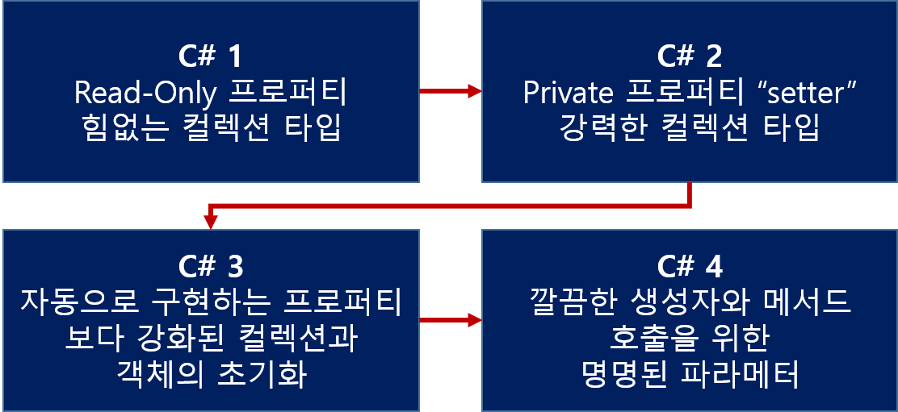

챕터 1 : C#의 변화
=================
간단하게 시대를 거쳐 C# 1~4의 기능이 어떻게 변화가 되었는지 소개하는 장을 적는다.

# 1-1 데이터 타입의 변천사
'Product'를 구성하는 클래스를 보게 될 것이다. 
이 예제를 통해 얼마나 많은 작업들을 이룰 수 있는지 살펴볼 것이고,
C#의 버전들이 어떻게 발전해 올 수 있었는지 살펴볼 것이고 전에 버전들에 비해서 얼마만큼 간단하면서 화려한 코드를 이용할 수 있는지 살펴볼 것이다.

## 1-1-1 C#1에서의 'Product' 타입
``` C#
// System.Collections 를 사용
    public class Product
    {
        // getter 프로퍼티를 만들기 위해 번거럽고 복잡한 많은 코드들을 작성해야 한다.
        string name;
        public string Name { get { return name; } }     // 만약 private setter를 제공하고 싶다면, setter 또한 정의 해주어야 한다.
        decimal price;
        public decimal Price { get { return price; } }
        public Product(string name, decimal price)
        {
            this.name = name;
            this.price = price;
        }
        public static ArrayList GetSampleProducts()
        {
            // ArrayList에 어떤 값이 추가되는지 알 수 없다.
            ArrayList list = new ArrayList();
            list.Add(new Product("상품 1", 1000));
            list.Add(new Product("상품 2", 2000));
            list.Add(new Product("상품 3", 3000));
            list.Add(new Product("상품 4", 4000));

            return list;
        }
        public override string ToString()
        {
            return string.Format("{0} : {1}", name, price);
        }
    }
```

위 예제를 통해 C#1의 3가지 한계를 정의할 수 있다.
1. ArrayList에 넣은 데이터에 대한 컴파일시 정보가 없다. GetSampleProducts 함수를 만들어 리스트에 값들을 추가하고 있지만 컴파일러는 어떤 값이 추가되는지 알 수 없다.
2. 코드에서 public 타입의 getter 속성을 프로퍼티에 제공했다. 이 이야기는 만약 private setter를 제공하고 싶을 때 setter 또한 정의해 주어야 한다.
3. 프로퍼티와 변수들을 만들기 위해서 string과 decimal과 같은 번거롭고 복잡한 많은 코드들을 작성해야 한다.

## 1-1-2 C#2에서 보다 강화된 리스트 타입
그렇다면 C#2에서는 어떻게 이러한 문제들을 해결할 수 있는지 살펴보자.

``` C#
// System.Collections.Generic을 사용
    public class Product
    {
        string name;
        public string Name
        {
            get { return name; }
            private set { name = value; }           // C#1에서 private setter가 추가되었다.
        }
        decimal price;
        public decimal Price
        {
            get { return price; }
            private set { price = value; }
        }
        public Product(string name, decimal price)
        {
            this.name = name;
            this.price = price;
        }
        public static List<Product> GetSampleProducts()
        {
            // Generic이 도입되면서 List<T>가 추가되었다.
            // 덕분에 반드시 지정한 타입명으로 할당될 수 있다는 것을 알 수 있다.
            List<Product> list = new List<Product>();
            list.Add(new Product("상품 1", 1000));
            list.Add(new Product("상품 2", 2000));
            list.Add(new Product("상품 3", 3000));
            list.Add(new Product("상품 4", 4000));

            return list;
        }
        public override string ToString()
        {
            return string.Format("{0} : {1}", name, price);
        }
    }
```

private setter가 추가되었고 Generic을 통해 List<T>를 사용할 수 있게 되었다.
이로써 1번 문제인 List내에 어떤 데이터 타입이 들어있는지 알 수 있게 되었다.

## 1-1-3 자동으로 구현되는 프로퍼티
이제 C#3 코드를 살펴보자.
C#3는 자동으로 구현되는 프로퍼티와 간단한 초기화 기능은 자주 람다 식과 비교되기는 하지만 람다 식보다는 간단하다.

``` C#
    public class Product
    {
        // name, price 변수를 따로 선언하지 않고도 사용할 수 있게 되었다.
        // getter를 통해 어디서든 접근이 가능하였고 일관성있게 수정되어 코드가 깔끔해졌다.
        public string Name { get; private set; }
        public decimal Price { get; private set; }

        public Product(string name, decimal price)
        {
            Name = name;
            Price = price;
        }
        // Name, Price를 직접 접근하여 초기화를 진행하기 때문에 Product(string name, decimal price) 생성자를 지우거나 기본 생성자를 추가해주어야 한다.
        public Product() { }
        public static List<Product> GetSampleProducts()
        {
            return new List<Product>
            {
                // 기본 생성자를 사용하고 있다.
                new Product{Name = "상품 1", Price = 1000 },
                new Product{Name = "상품 2", Price = 2000 },
                new Product{Name = "상품 3", Price = 3000 },
                new Product{Name = "상품 4", Price = 4000 }

            };
        }
        public override string ToString()
        {
            return string.Format("{0} : {1}", Name, Price);
        }
    }
```

선언된 프로퍼티들은 어떤 변수들이나 코드들과 연관되어 있지 않고 클래스 어디에서든지 이용할 수 있게 가정하였다.
이로써, 어느정도 일관성 있게 개선이 가능해졌다. 해당 코드에는 private 파라미터들이 없는 새로운 생성자를 선언하였다.
만약 이 생성자를 선언하지 않을 경우에 Product 타입의 인스턴스를 선언하는 다른 코드들 밖에 작성하지 못하게 된다.

## 1-1-4 C#4의 명명된 프로퍼티
C#4에서는 private setter 타입이 public 타입으로 변형될 수 없다고 하더라도 그래도 private가 변할 수 있는 상황이 생길 경우에 C#4의 이 기능을 이용해서 보다 코드를 깔끔하게 정의할 수 있게 한다.

``` C#
    public class Product
    {
        // readlony를 통해 런타임에 변수값이 초기화가 되고 가독성이 증가하였다.
        readonly string name;
        public string Name { get { return name; } }
        readonly decimal price;
        public decimal Price { get { return price; } }
        public Product(string name, decimal price)
        {
            this.name = name;
            this.price = price;
        }

        public static List<Product> GetSampleProducts()
        {
            return new List<Product>
            {
                new Product(name : "상품 1", price : 1000 ),
                new Product(name : "상품 2", price : 2000 ),
                new Product(name : "상품 3", price : 3000 ),
                new Product(name : "상품 4", price : 4000 )

            };
        }
        public override string ToString()
        {
            return string.Format("{0} : {1}", name, price);
        }
    }
```

위 코드를 사용하면 상당히 많은 수의 파라미터를 가지고 있는 메서드나 생성자에서는 더 명확하게 정의할 수 있다는 것이 장점이다.
그리고 만약에 파라미터들이 모두 같은 타입이거나 null을 대입해주어야 하는 경우가 생긴다면 유용하게 사용할 수 있다.
또한 파라미터의 이름을 기록할 수 있기 때문에 코드의 가독성 또한 상당히 향상시킬 수 있을 것이다.


지금까지의 변화는 상대적으로 최소의 변화만 보여주었다. 실제로 제네릭 타입(List<T>)의 추가로 C#2가 가장 큰 변화였고 가장 유용한 부분일 것이다.

# 1-2 정렬과 필터

## 1-2-1 Product 타입을 이름으로 검색하기
어떤 리스트에서 특정한 순서로 보여주기 위한 가장 쉬운 방법은 일단 리스트를 정렬한 뒤에 그냥 정렬된 순서대로 출력하는 것이다.
닷넷1. 1 에서는 주로 ArrayLis t. Sort를 사용해 왔지만 여기 예제에서는 IComparer 타입을 상속받아 구현하여 구현해 볼 것이다.

``` C#
    class ProductNameComparer : IComparer
    {
        public int Compare(object x, object y)
        {
            // 컴파일러에게 객체를 인식시키기 위해 타입 변환(캐스팅) 시도
            
            Product first = (Product)x;
            Product second = (Product)y;
            return first.Name.CompareTo(second.Name);
        }
    }
(중략)
    ArrayList products = CSharp_1.Product.GetSampleProducts();
    products.Sort(new CSharp_1.ProductNameComparer());

    // 리스트 안의 각각의 요소들은 Product 타입으로 변환된다.
    foreach (CSharp_1.Product product in products)
    {
          Console.WriteLine(product);
    }
```

예제는 '이름'을 통해 오름차순으로 정렬을 하고 있다.
Compare 매소드를 살펴보면 Product로 타입 변환을 하고 있는데 이것은 컴파일러에게 객체를 인식시키기 위해서이다.
이는 컴파일러가 자동으로 출력을 처리하기 때문에 명확하지 않아 보일 수 있다. 
그리고 foreach 루프에서 리스트 안의 각각의 요소들은 Product 타입으로 변환된다.

다음은 C#2 제네릭 타입을 이용하여 이를 보완하는 예제를 소개한다.

``` C#
// 타입을 지정하여 명확해졌으며, 변환할 필요가 사라졌다.
    class ProductNameComparer : IComparer<Product>
    {
        public int Compare(Product x, Product y)
        {
            return x.Name.CompareTo(y.Name);
        }
    }
```

IComparer<T>를 통해 Product 타입으로 선언했기 때문에 더 간단히 처리할 수 있다. 즉, 캐스팅 작업 자체가 필요 없는 것이다. 
여기서 개선할 수 있는 부분이 바로 products 리스트를 별도의 인터페이스 구현 없이 간단하게 비교하고 싶을 경우에 적절한 예제코드가 있다.

``` C#
    List<CSharp_2.Product> products = CSharp_2.Product.GetSampleProducts();
    // C#2 에서는 델리게이트를 통해 별도의 인터페이스 구현없이 바로 사용이 가능하다.
    products.Sort(delegate (CSharp_2.Product x, CSharp_2.Product y)
    { return x.Name.CompareTo(y.Name); }
     );
    // 리스트 안의 각각의 요소들은 Product 타입으로 변환된다.
    foreach (CSharp_2.Product product in products)
    {
       Console.WriteLine(product);
    }
```

댈리게이트 인스턴스를 구현한 인스턴스를 볼 수 있고 이 구문에서는 비교를 실행할 Sort 메서드를 대신 제공할 수 있게 되었다. 
그렇다면 C#3에서는 이 코드를 어떻게 더 발전시킬 수 있을지 궁금할 것이다. 
먼저 익명 메서드를 사용했던 델리게이트 인스턴스를 보다 간단하게 수정해 보도록 하겠다.

``` C#
    List<CSharp_3.Product> products = CSharp_3.Product.GetSampleProducts();
    // 람다 식을 통해 delegate 키워드 없이 무명 함수를 구현하였다.
    products.Sort((x, y) => x.Name.CompareTo(y.Name));
```
여기서 람다 식이라는 이상한 구분을 접하게 된다. delegate라는 키워드를 이용하지 않았을 뿐더러 파라미터 타입도 정의하지 않았다. 
그리고 C#3에서는 products의 리스트들을 수정하지 않고도 쉽게 이름들을 출력할 수 있다. 다음 코드에서 OrderBy 메서드를 살펴보도록 하자.

``` C#
    List<CSharp_3.Product> products = CSharp_3.Product.GetSampleProducts();

    // 확장메서드를 통해 List의 OrderBy 사용
    foreach (CSharp_3.Product product in products.OrderBy(p => p.Name))
    {
       Console.WriteLine(product);
    }
```

OrderBy는 List의 확장 메서드가 있기에 호출이 가능하다. 
기서는 리스트 자체를 정렬히는 것이 아니라 리스트의 내용을 특정 순서에 맞추어 가져오는 것뿐이다. 
여기서 중요한 점은 코드가 훨신 더 간결하고 가독성이 좋다는 것이다. 이런 표현의 간소화가 C#3의 주요 장점 중 하나이다. 
데이터 쿼리와 조작과정의 개별 코드가 단순하기 때문에 좀 더 큰 변환들도 간결하고 읽기 쉬운 몇 줄의 코드로 작성할 수 있다. 
이는 곧， 조금 더 ‘데이터-중심’의 사고방식을 장려한다.


## 1-2-2 컬렉션 쿼리
다음으로 할 일은 특정 기준에 맞는 항목 그 중에서도 가격이 3000원 이상인 항목들을 모두 찾는다. 
C#1을 이용하는 경우 리스트의 각 항목에 대해 반복문을 이용하여 가격 값을 검사한 후 조건에 맞는 경우 이를 출력한다.

``` C#
// 반복문들 돌며 간단하게 if문으로 조건에 맞는 데이터를 출력하고 있다.
     foreach(CSharp_1.Product product in products)
     {
         if (product.Price > 3000)
            Console.WriteLine(product);
     }
```
C#2를 이용하면 이를 조금은 해소할 수 있다.

``` C#
// 델리게이트 함수인 test와 출력 함수인 print를 다른 메서드에 넘겨 사용하고 있다.
     Predicate<CSharp_2.Product> test = delegate (CSharp_2.Product p) { return p.Price > 3000; };
     List<CSharp_2.Product> matches = products.FindAll(test);
     Action<CSharp_2.Product> print = Console.WriteLine;
     matches.ForEach(print);
```
이 코드가 C#1 보다 간단하다고 보기는 힘들지만 훨씬 더 견고해진 것은 사실이다. 
특히 검사하고자 하는 조건과 이에 맞는 항목에 대해 하려고 하는 동작을 독립적으로 변경하는 것이 훨씬 더 쉬워졌다. 
앞에서 사용한 델리게이트 변수들 즉, test 와 print를 다른 메서드에 넘길 수도 있다. 
이렇게 하여 전혀 다른 조건에 전혀 다른 동작을 할 수도 있을 것이다.

``` C#
// 위 조건식을 한 문장으로 작성이 가능하다.
     products.FindAll(delegate (CSharp_2.Product p) { return p.Price > 3000; })
         .ForEach(delegate (CSharp_2.Product p) { Console.WriteLine(p); });
```
좀 더 나아 진 것 같다. 하지만 delegate(Product P)와 대괄호가 여전히 걸린다. 이런 것들은 코드의 잡음이고 가독성을 떨어트릴 뿐이다.
C#3을 이용하면 이 문제들을 극적으로 향상시켜 델리게이트의 실제 로직외의 잡다한 것들을 없앨 수 있다.

``` C#
    List<CSharp_3.Product> products = CSharp_3.Product.GetSampleProducts();
    foreach(CSharp_3.Product product in products.Where(p => p.Price > 3000))
    {
        Console.WriteLine(product);
    }
```
조건 검사용 람다 식과 알맞는 이름의 메서드 조합으로 인해 위의 코드를 그냥 큰 소리로 읽고 별 다른 생각 없이도 바로 이해할 수 있을 정도가 되었다.
Where 메서드의 인자에 다른 변수를 사용한다거나 Console.WriteLine 호출 대신 Action<Product>를 사용할 수도 있다.
익명 메서드를 이용하면 델리게이트를 간단하게 만들 수 있고 람다 식을 이용하면 훨씬 더 간단해진다. 
두 경우 모두 코드가 간단해진 만큼 쿼리나 정렬 작업에 대한 코드를 가독성을 떨어트리지 않으면서 foreach 반복문 안에 넣을 수 있다.


# 1-3 비어있는 데이터 다루기

## 1-3-1 미정인 가격의 표현
앞에서 본 제품 목록에 지금 현재 판매되고 있는 제품뿐만 아니라 아직 출시되지 않은 제품까지 포함해야 한다고 생각해 보자. 
경우에 따라서는 제품 가격을 아예 모를 수도 있을 것이다. 만약 정수 타입이 참조 타입이라면 가격을 모르는 경우에는 
그냥 null을 시용해도 되겠지만 값 타입인 만큼 그렇게 할 수가 없다. 다음 3가지를 일반적인 해결책으로 들 수 있다.
• 정수 값을 참조 타입으로 래핑 (Wrapping) 한다.
• 가격을 알지 못하는 경우를 위해 별도의 Boolean 값을 유지한다.
• ‘매직 값(magic value)’ 예를 들면 decimal.MinValue를 정해 두고 이 값을 이용해 가격을 알지 못히는 경우를 나타낸다.
위의 3가지 방식으로 해결이 가능하지만 더 간단한 방법이 존재한다.
변수와 속성 선언을 하는 구문에 문자 하나만 추가 해주면 이 문제를 해결 할 수 있다. 
C#2에서 새롭게 추가된 Nullable<T> 구조체와 이를 위한 약간의 편의 요소(Syntactic sugar)를 곁들이면 이 문제를 훨씬 더 쉽게 해결할 수 있다.

``` C#
    decimal? price;                             // C#2 부터 nullable 타입으로 지정이 가능하다.
    public decimal? Price
    {
        get { return price; }
        private set { price = value; }
    }
```
생성자의 파라미터도 decimal?로 변경해 주면 생성자 인자에 null을 넘기는 것도 가능하며 Price 클래스 내부에서 Price = null; 이라고 쓸 수도 있다.
특정 제품의 가격이 미정인지 검사하기 위해서는 해당 속성 값이 null 인지 확인하거나 HasValue 속성을 사용하면 된다.
``` C#
    // nullable 타입을 통해 구조체 타입 변수에 null 삽입이 가능하다.
    products.Add(new CSharp_3.Product("상품 6", null));
    foreach(CSharp_3.Product product in products.Where(p => p.Price == null))
    {
        Console.WriteLine("미출시 상품 : " + product.Name);
    }
```

## 1-3-2 옵션 파라미터들과 기본 값
가끔은 메서드한테 필요한 모든 것을 알려주고 싶지 않을 경우가 있다. 만약 특정 파라미터에 항상 같은 값만 전달하게 되는 경우 예가 될 수 있다.
일반적으로 이 문제를 해결하기 위해서 오버로드 메서드를 이용할 수는 있겠지만 C#에서는 이러한 불편을 보다 간소화하기 위해서
옵션 파라미터 기능을 제공하고 있다.
``` C#
      decimal? price;
      public decimal? Price
      {
          get { return price; }
          private set { price = value; }
      }
      // C# 4 부터 옵션 파라미터 기능을 이용해 추가적으로 생성자 오버로딩을 만들 필요가 없다.
      // 기본 매개변수 라고 부르기도 한다.
      public Product(string name, decimal? price = null)
      {
          this.name = name;
          this.price = price;
      }
```
이것은 꼭 null을 지칭하는 것은 아니다. 기본 값을 지정하는 것도 가능하다.


